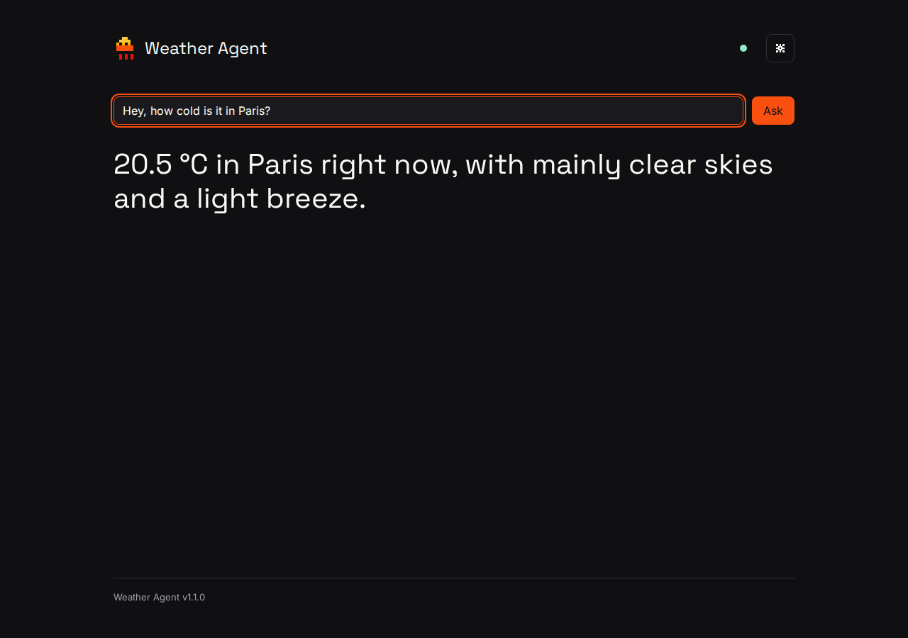

# Weather Agent

Ask about the weather in your own words. A language model reads the question
and chooses tool calls, code looks the place up and fetches the forecast from
Open-Meteo, code resolves dates, units and verdicts, and a model phrases the
answer. Every request is traced end to end, guarded, priced, and can be
replayed without network. A golden set of fifteen questions scores each model
on four layers with no model as judge.

Built for a technical interview on 17 September 2026. Temperatures in Celsius.



## Run it

Requirements: Python 3.12 or newer (built and tested on 3.14) and API keys for
Mistral and Anthropic.

```bash
python3 -m venv .venv
.venv/bin/pip install -r requirements.txt
cp .env.example .env        # then put your keys in .env; it is never committed
.venv/bin/uvicorn weather_agent.main:app --reload
```

Open http://127.0.0.1:8000. Type a question, or click one of the two example
questions. The gear opens the settings window; the dot next to it shows the
health of every dependency and lists them when clicked.

Command line, same pipeline, no browser:

```bash
.venv/bin/python -m weather_agent ask "Hey, how cold is it in Paris?"
.venv/bin/python -m weather_agent ask "Will it rain in New York tomorrow?" --offline
```

## Tests

```bash
.venv/bin/pytest -q
```

Tests never touch the network. Service tests read recorded responses under
`tests/fixtures`; provider tests use an httpx mock transport.

## Golden set and eval

The fifteen golden questions live in `weather_agent/eval/golden.py`. Each item
states the expected tool calls, the expected outcome, the place, the time and the
rules the answer must satisfy. Run them against one model or all four:

```bash
.venv/bin/python -m weather_agent.eval --model all
.venv/bin/python -m weather_agent.eval --model mistral-small-latest --offline
```

The report shows, per model, the pass rate on four layers, mean latency and
mean cost, then every failure with its layer and reason:

| Layer | Checks |
|---|---|
| tools | which tools the model called, in which order |
| usage | outcome, country and region of the chosen place, distance to the city centre, the resolved date against an independent zoneinfo computation, the requested block, and that no forecast was fetched where none is allowed |
| grounding | every number in the answer exists in the tool results, within 0.5 |
| rules | per-item text rules: contains °C, starts with yes, no or unlikely, is Dutch, names the date, and so on |

Results are saved under `weather_agent/eval/results/` and shown on the Eval
page of the settings window, which can also start a run.

## Offline mode

Every service and model response is recorded under `fixtures/`, keyed by the
request. The recordings of the golden set are committed. The Models page has an
offline switch that forces replay; in live mode a network failure falls back to
the recording, the answer says so, and the health dot turns amber.

## Settings window

Models: one dropdown per pipeline step and the offline switch. Trace: the last
request with every guardrail event, then every step with request, raw response,
result, tokens, latency and cost. Eval: the table above and a run button. Cost:
the price table with sources, the last request, the session total and the last
eval. Model suitability and EU AI Act: to be written after the eval results.

## Guardrails

Before the model: input at most 500 characters, 60 requests per minute per
client. Around the model: at most four model calls per request, only registered
tools. After the model: every number in the answer must match a tool result,
otherwise "I could not verify this result." is appended and the reason logged;
an answer that repeats a system prompt sentence is blocked. Every check, pass or
fail, is in the trace.

## Dependencies

| Package | Why |
|---|---|
| fastapi | the HTTP routes and static file serving, with request validation |
| uvicorn | the server that runs the FastAPI app |
| httpx | one HTTP client for the two model providers and the two Open-Meteo endpoints, mockable in tests |
| pytest | the test runner |

Nothing else. The .env file is read by a twelve-line function.

## Data and terms

Weather data by [Open-Meteo.com](https://open-meteo.com/), CC BY 4.0, free for
non-commercial use within 10,000 calls a day. Location data based on GeoNames
through the Open-Meteo Geocoding API. Model prices are list prices per million
tokens from https://mistral.ai/pricing/api and
https://platform.claude.com/docs/en/about-claude/pricing, read on 2026-09-16.

## Documents

- [docs/ARCHITECTURE.md](docs/ARCHITECTURE.md): one request end to end, model versus code, rejected alternatives
- [docs/DESIGN.md](docs/DESIGN.md): the design system
- [docs/superpowers/specs/2026-09-16-weather-agent-design.md](docs/superpowers/specs/2026-09-16-weather-agent-design.md): the design spec
- [docs/superpowers/plans/2026-09-16-weather-agent.md](docs/superpowers/plans/2026-09-16-weather-agent.md): the implementation plan
- [CHANGELOG.md](CHANGELOG.md): what changed per version
