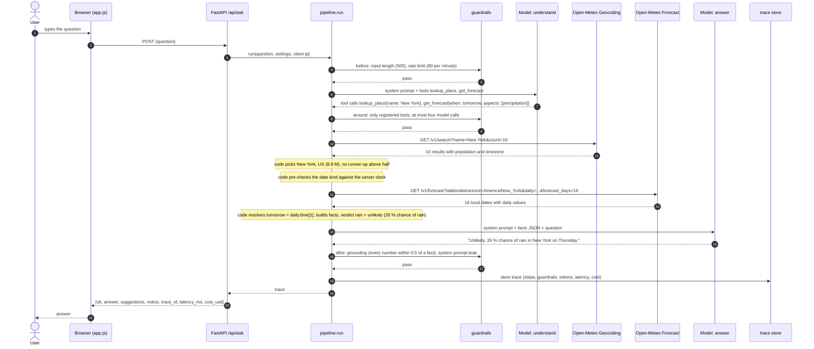
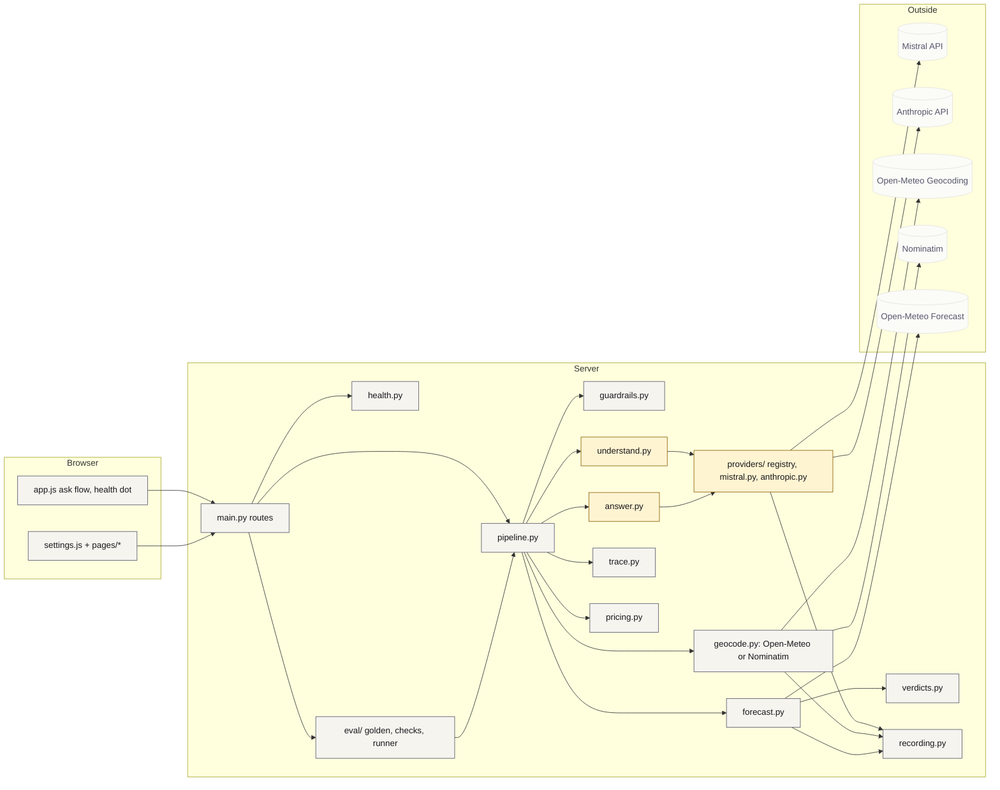

# Architecture

Weather Agent answers a natural-language weather question in four pipeline
steps. Two are model steps, two are service steps, and everything in between is
plain code. This document shows one request end to end, the component view with
model and code marked, the alternatives that were rejected, and how tracing,
recording and the eval work.

## One request, end to end

The example is the assignment question "Will it rain in New York tomorrow?".
Every arrow is a call that appears in the trace.

Two model calls per request by construction. The budget guardrail allows the
four the assignment permits and would fail the request at a fifth, so a future
retry or extra step cannot run away unnoticed.

## Components: model versus code

Amber boxes call a language model. Grey boxes are plain code. The model is only
ever asked two things: which tools to call with which words, and how to phrase a
facts object. It never sees a coordinate to copy, never converts a date, never
decides whether a number means rain.

| Decision | Made by | Where |
|---|---|---|
| Is this a weather question, which place, which time words | model | understand.py prompt and tool schemas |
| Which of several places is meant | code | geocode.choose, score ratio rule: population for Open-Meteo, importance for Nominatim |
| Timezone | code, from the geocoding result, or "auto" so Open-Meteo reports it | forecast.build_request |
| Which local date "tomorrow" or "Saturday" is | code, from the dates the service returns | forecast.resolve |
| Is the date within reach | code, before any call and again after | forecast.precheck, forecast.resolve |
| Units | code, Open-Meteo defaults | forecast.UNITS |
| Rain, windy, snow yes or no | code, fixed thresholds | verdicts.py |
| Sentence, language, tone | model | answer.py prompt |
| Are the numbers in the answer real | code | guardrails.check_grounding |

## Rejected alternatives

| Topic | Chosen | Rejected | Why rejected |
|---|---|---|---|
| Step 1 mechanism | Native function calling, one round, two tools, code links them | Classic agent loop where the model receives the geocode result and calls the forecast tool with coordinates | Three or more model calls, a provider-specific tool-result protocol, and the model handles coordinates |
| Step 1 mechanism | as above | Structured JSON plan without tools | The eval's tool-selection layer would measure a JSON field, and function calling is what the providers optimise for |
| Default geocoder | Open-Meteo Geocoding | Nominatim as default | One request per second, no population, no timezone. Nominatim is available as the second option: same candidate shape, ranked by its importance score, throttled to the policy, with an identifying User-Agent; the forecast asks Open-Meteo for the timezone it lacks |
| Date handling | Resolve on the local dates the forecast service returns | Timezone arithmetic in code | Avoids zoneinfo edge cases and keeps one code path; the eval re-checks with zoneinfo independently |
| Provider access | REST with httpx | Official SDKs | Two large dependency trees, hidden retries, and the wire format would not be in the trace unchanged |
| Frontend | Plain HTML, CSS and ES modules | Vite with React or Preact | A build step and hundreds of packages for one page and one modal |
| Fonts | Self-hosted woff2 | Google Fonts link | A render-blocking request on a wifi that is up but dead |
| Rejections | English templates from code | Model-phrased in the user's language | One more model call per rejection, and a hostile input shown to a model twice |
| Settings layout | Centred 960 px modal | 320 px side panel from the first DESIGN.md | Too narrow for the eval table and the trace |
| Not-found example | Qwxlorbia | Atlantis | Atlantis exists in South Africa and Florida |
| Eval scoring | Code checks per layer | Model as judge | Scoring is validation, which the principles assign to code; code checks are reproducible, cost nothing and keep a second model out of the loop |
| Eval trigger | On demand from the page and the command line | Scheduler | A scheduled eval is not a per-request guardrail |

## Trace

`trace.Trace` holds the question, the settings in force, one `Step` per
pipeline step with request, raw response, parsed result, tokens, latency, cost
and source (live, replayed or skipped), every `GuardrailEvent` with its rule and
outcome, the final answer, suggestions, notice, error and error detail, and the
totals. Model steps store the request body and URL, never the headers, so no key
can reach a trace or a recording. The store keeps the last twenty traces in
memory. The eval saves each item's trace inside its results file.

## Guardrails

| Stage | Rule | Effect |
|---|---|---|
| before | input_length | more than 500 characters is answered by a template, no model call |
| before | rate_limit | more than 60 requests per minute per client is answered by a template |
| around | registered_tools | a tool name not in the registry is ignored and logged |
| around | model_call_budget | the fifth model call in one request raises and the event is logged as failed; the counter is shown in every trace |
| after | grounding | a number in the answer that is not within 0.5 of a fact appends "I could not verify this result." and logs which number |
| after | system_prompt_leak | a whole sentence of either system prompt in the answer blocks it |

Every evaluation, pass or fail, is a trace event. The Trace page shows them in
their own block above the steps.

## Recording and offline mode

`recording.fetch` keys every service and model request by a hash of its
canonical JSON and stores the response under `fixtures/<kind>/`. The system
prompts contain no clock, so the same question hashes to the same key on any
day. The other side of that coin: a change to a system prompt, a tool schema or
the shape of the facts object changes the keys, and the model recordings made
before it can never be hit again. After such a change, run the eval live once
to re-record and delete the recordings whose prompt no longer matches. The offline switch on the Models page forces replay. In live mode a network
failure falls back to the recording when one exists; the step is marked
replayed, the answer's meta line says so, and the health dot turns amber. A
question that has no recording in offline mode gets its own outcome,
`no_recording`, with a sentence that says how to proceed.

## Eval

The golden set is fifteen questions in `eval/golden.py`. `eval/runner.py`
runs them through `pipeline.run` with the model under test on both model steps
and scores each with `eval/checks.py`:

1. tools: the tool names the model called, in order, against the acceptable sequences
2. usage: outcome, country and region of the chosen place, distance from the city centre, the resolved date against zoneinfo, the requested block, and that no forecast call was made where none is allowed
3. grounding: the grounding guardrail passed
4. rules: per-item predicates on the answer text, such as contains °C, starts with yes, no or unlikely, is Dutch, names the date

A layer that does not apply to an item is counted as such. The report per model
has pass rate per layer, mean latency, mean cost, and the failures with layer
and reason. Runs are saved under `eval/results/` and the Eval page shows the
latest per model.
